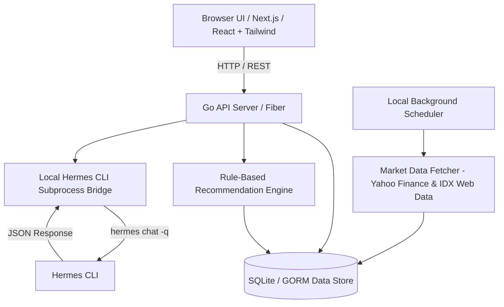

# Architecture & System Design — Portofolio IHSG & Recommendations



## Stack Choices

- **Language & Server**: Go (Fiber) for backend services, SQLite (GORM) for storage, background scheduler, and market data engine.
- **Frontend**: Next.js / React with Tailwind CSS and Radix/Base UI components.
- **Data Integrations**: Delayed market prices (Yahoo Finance API/Scraper) + official IDX data endpoints.
- **AI Bridge**: Go `os/exec` runner calling local `hermes chat -q` with custom prompt template and schema enforcement.

## System Components

### 1. App Server (Go Fiber)
- Local HTTP backend serving both REST API endpoints and static React frontend bundle (or running unified dev server).
- Internal SQLite database store (`portofolio.db`).

### 2. Market Data & Refresh Worker
- Scheduled background job running daily (configurable toggle ON/OFF in settings).
- Manual trigger endpoint (`POST /api/market-data/refresh`).
- Scrapes/fetches delayed market quote + key financial metrics for held stocks + LQ45/Kompas100 universe.

### 3. Rule Engine
- Pure Go deterministic scoring logic calculating short-term (6-12m) and long-term (3-5y) scores (0-100) and mapping to `BUY`, `HOLD`, `SELL`.
- Automatically executes whenever new market data arrives.

### 4. Hermes CLI Subprocess Bridge
- Invoked on demand when user clicks "Analisis AI" for a stock.
- Constructs context JSON:
  ```json
  {
    "ticker": "BBCA",
    "portfolio_context": {"shares": 100, "weight_pct": 25.0},
    "market_data": {"price": 6200, "per": 18.5, "pbv": 3.2, "roe": 18.2, "der": 0.2},
    "technical_indicators": {"ma20": 6150, "ma50": 6000, "ma200": 5800},
    "rule_score": {"short": {"verdict": "BUY", "score": 78}, "long": {"verdict": "BUY", "score": 85}},
    "sources": ["https://finance.yahoo.com/quote/BBCA.JK", "https://www.idx.co.id/..."]
  }
  ```
- Subprocess call:
  ```bash
  hermes chat -q "Analisis saham IHSG berikut dan berikan rekomendasi independen..."
  ```
- Parses structured JSON response from Hermes and updates SQLite.
